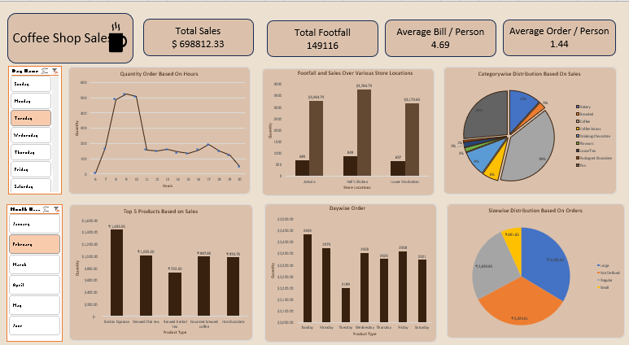

# Coffee Shop Sales Analysis Dashboard

## Dashboard Preview

  

---

## Project Overview

This project presents an interactive Coffee Shop Sales Analysis Dashboard developed using Microsoft Excel. The dashboard provides insights into customer footfall, sales trends, product performance, store-wise sales, and order analysis through data visualization and business analytics techniques.

---

## Key Insights

### 1. Total Sales Analysis
- Total sales recorded were approximately **$698K**.
- The dashboard helps monitor overall business revenue performance.

### 2. Customer Footfall Analysis
- Total customer footfall exceeded **149K visitors**.
- Peak customer activity periods were identified using hourly trends.

### 3. Average Bill & Orders
- Average bill per customer was approximately **4.69**.
- Average orders per person were around **1.44**.

### 4. Quantity Ordered by Hour
- Sales activity was highest during morning and afternoon hours.
- Customer ordering trends varied throughout the day.

### 5. Store-wise Sales Performance
- Hell’s Kitchen generated the highest sales among all store locations.
- Astoria and Lower Manhattan also contributed significantly.

### 6. Category-wise Sales Distribution
- Coffee contributed the highest share of overall sales.
- Bakery items and beverages also showed strong sales performance.

### 7. Top Products by Sales
- Barista Espresso generated the highest product sales.
- Brewed Chai Tea and Hot Chocolate were among the top-performing products.

### 8. Day-wise Orders Analysis
- Orders were analyzed across all weekdays.
- Certain weekdays recorded higher customer activity compared to others.

### 9. Size-wise Distribution Based on Orders
- Large-sized orders contributed the highest percentage of sales.
- Regular and small-sized orders also formed a significant portion.

---

## Tools & Technologies Used

- Microsoft Excel
- Pivot Tables
- Pivot Charts
- Slicers
- Data Visualization Techniques

---

## Skills Demonstrated

- Data Cleaning
- Sales Data Analysis
- Dashboard Development
- Business Insight Generation
- Interactive Data Visualization

---

## Conclusion

The Coffee Shop Sales Analysis Dashboard effectively highlights customer behavior, sales patterns, store performance, and product trends. This project demonstrates practical Excel dashboarding skills and the ability to transform raw sales data into meaningful business insights.
