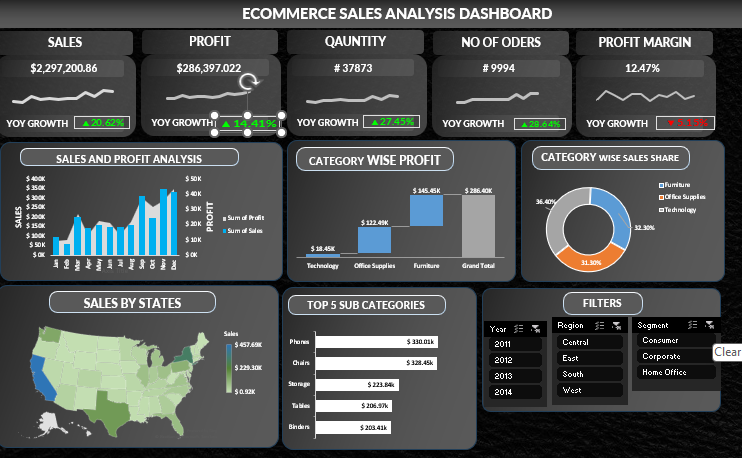

# Ecommerce Sales Analysis Dashboard

## Dashboard Preview

  

---

## Project Overview

This project presents an interactive Ecommerce Sales Analysis Dashboard created using Microsoft Excel. The dashboard provides insights into sales performance, profit analysis, order quantity, category-wise contribution, and regional sales trends through interactive visualizations and business intelligence techniques.

---

## Key Insights

### 1. Sales Performance Analysis
- Total sales recorded were approximately **$2.29M**.
- Year-over-Year (YOY) sales growth showed a positive increase.

### 2. Profit Analysis
- Total profit reached approximately **$286K**.
- Profit growth demonstrated strong improvement compared to previous periods.

### 3. Quantity & Orders Analysis
- Total quantity sold exceeded **37K units**.
- Nearly **10K orders** were successfully processed.

### 4. Profit Margin Analysis
- Overall profit margin was around **12.47%**.
- The dashboard highlights yearly changes in profitability.

### 5. Category-wise Profit
- Furniture generated the highest overall profit.
- Office Supplies and Technology categories also contributed significantly.

### 6. Category-wise Sales Share
- Sales distribution was analyzed across different product categories.
- Furniture and Office Supplies held major sales shares.

### 7. State-wise Sales Analysis
- Sales performance was visualized across various states in the USA.
- Certain states generated considerably higher revenue than others.

### 8. Top Sub-Categories
- Phones generated the highest sales among sub-categories.
- Chairs, Storage, Tables, and Binders also performed strongly.

### 9. Interactive Filters
- The dashboard includes filters for:
  - Year
  - Region
  - Customer Segment
- These filters enable dynamic and interactive analysis.

---

## Tools & Technologies Used

- Microsoft Excel
- Pivot Tables
- Pivot Charts
- Slicers
- Data Visualization Techniques

---

## Skills Demonstrated

- Data Cleaning
- Sales & Profit Analysis
- Dashboard Development
- Business Intelligence
- Interactive Data Visualization

---

## Conclusion

The Ecommerce Sales Analysis Dashboard effectively provides insights into sales growth, profitability, category performance, and regional trends. This project demonstrates practical expertise in Excel dashboard creation and business data analysis for decision-making purposes.
