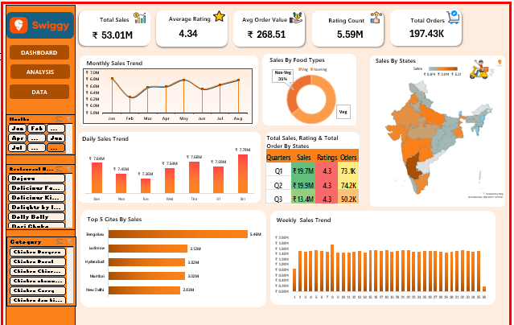

# Swiggy Sales Data Analysis Dashboard

## Dashboard Preview

  

---

## Project Overview

This project presents an interactive Excel dashboard developed to analyze Swiggy sales performance and customer ordering trends. The dashboard provides valuable insights into food sales, customer ratings, order trends, city-wise performance, and category analysis using data visualization techniques.

---

## Key Insights

### 1. Monthly Sales Trend
- Sales performance was analyzed month-wise.
- Sales showed fluctuations across different months.
- Highest sales were observed during peak ordering periods.

### 2. Sales by Food Types
- Veg and Non-Veg food categories were compared.
- Veg food contributed the highest percentage of total sales.

### 3. State-wise Sales Analysis
- The dashboard visualizes sales distribution across Indian states.
- Some states generated significantly higher revenue compared to others.

### 4. Daily Sales Trend
- Daily sales trends were analyzed to identify high-performing days.
- Certain days showed higher customer ordering activity.

### 5. Quarterly Performance Analysis
- Quarterly sales, ratings, and order counts were compared.
- Q2 recorded the highest overall sales performance.

### 6. Top Cities by Sales
- Bengaluru generated the highest sales among all cities.
- Lucknow, Hyderabad, and Mumbai also performed strongly.

### 7. Weekly Sales Trend
- Weekly order trends were visualized for performance monitoring.
- Sales remained relatively stable throughout the weeks.

---

## Tools & Technologies Used

- Microsoft Excel
- Pivot Tables
- Pivot Charts
- Slicers
- Data Visualization Techniques

---

## Skills Demonstrated

- Data Cleaning
- Sales Data Analysis
- Dashboard Development
- Business Insight Generation
- Interactive Data Visualization

---

## Conclusion

The dashboard effectively highlights sales patterns, customer preferences, city-wise performance, and food category trends. This project demonstrates practical Excel dashboarding skills and the ability to derive business insights from raw sales data.
